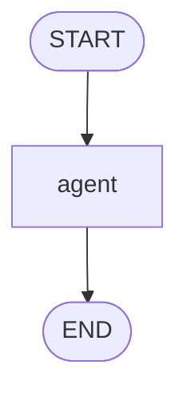

<!--
  Generated by scripts/export_langgraph_mermaid.py
  Sources: src/graph_agent.py
  Regenerate: make graph
-->

# LangGraph

```mermaid
flowchart TD
  __start__(["START"])
  __end__(["END"])
  agent["agent"]
  __start__ --> agent
  agent --> __end__
```
